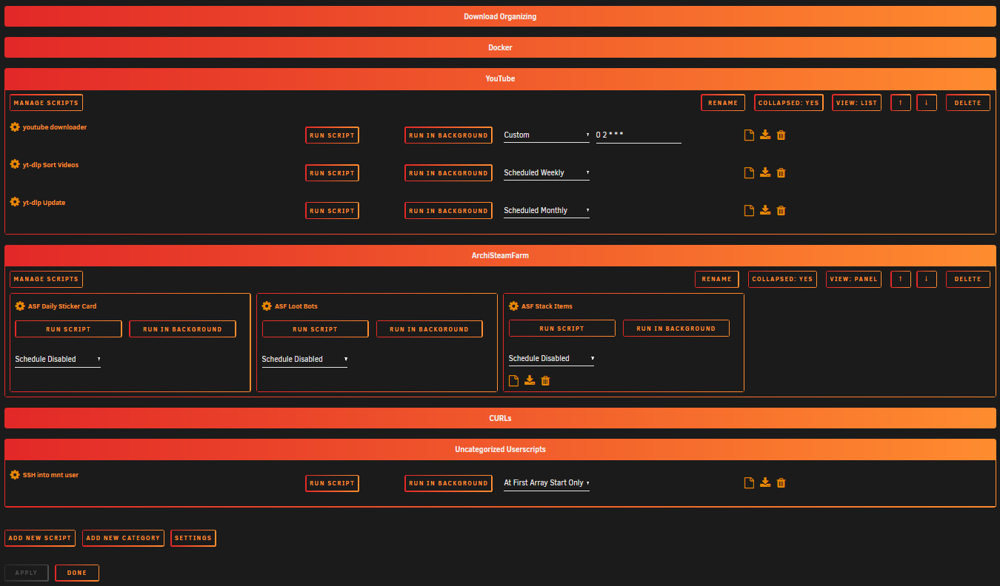
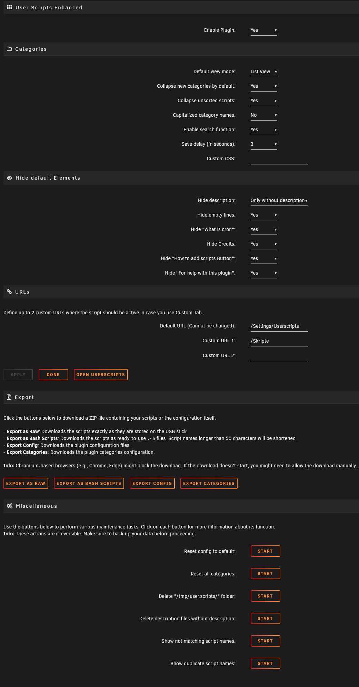

#  User Scripts Enhanced Plugin for Unraid

User Scripts Enhanced is a UI enhancement plugin for the original "User Scripts" plugin by Andrew Zawadzki (Squid).
It provides additional features and improved interface for managing user scripts on your Unraid server.

**Important**: The original [User Scripts plugin](https://forums.unraid.net/topic/48286-plugin-ca-user-scripts/) must be installed!

[](https://ko-fi.com/kurotaku1337)

---

## Installation

You can either install it from the Community Applications in your Unraid Server or manually.

1. Ensure you have the [User Scripts plugin](https://forums.unraid.net/topic/48286-plugin-ca-user-scripts/) installed
2. Connect to your Unraid server via SSH
3. Run:
   ```bash
   cd /boot/config/plugins
   wget https://github.com/Kurotaku-sama/unraid.user.scripts.enhanced/raw/main/user.scripts.enhanced.plg
   plugin install /boot/config/plugins/user.scripts.enhanced.plg
   ```

---

## Features

- **Script Categories**: Organize scripts into collapsible categories
- **View Modes**: Two view modes can be used List & Panel
- **Search**: Search directly within the User Scripts page for your scripts
- **Clean Interface**: Hide unwanted elements to reduce page size
- **Custom CSS**: Adjust the appearance to match your theme
- **Export**: Export your scripts as they are stored on your drive or directly as usable .sh files
- **Bugfixes**: this fixes some bugs that are in the User Scripts Plugin
- **And a much more**


*Enhanced Userscripts interface*


*Settings interface*

---

## Disclaimer

This plugin is provided as-is without warranty. The developer cannot be held responsible for any data loss or system instability. Always maintain backups of important scripts and configurations.

---

## Notes

- This plugin enhances but does not replace the original User Scripts functionality. <br>All core functions are only provided by the original plugin.

- If you uninstall the plugin, all configuration and category data will be deleted. <br>
Therefore, it's recommended to back up the config and categories beforehand if you plan to reinstall the plugin later.<br>
You can restore them by placing the backed-up files into
<code>/boot/config/plugins/user.scripts.enhanced</code>.

---

## Libraries Used

- **[CodeMirror](https://codemirror.net/)**
  Used to provide a clean, responsive, syntax-highlighted editor for the *Custom CSS* field, making it easier to write and maintain custom styles directly within the plugin settings.

---

## Known Issues

- Rapidly refreshing the page multiple times can cause AJAX requests to be aborted or delayed by the browser. This behavior depends on the browser used — for example, it occurs in Firefox but typically not in Chromium-based browsers. As a result, slower loading times may occur because the PHP backend is briefly overwhelmed handling these requests. Despite this, the categories and scripts will typically load correctly after a short delay.