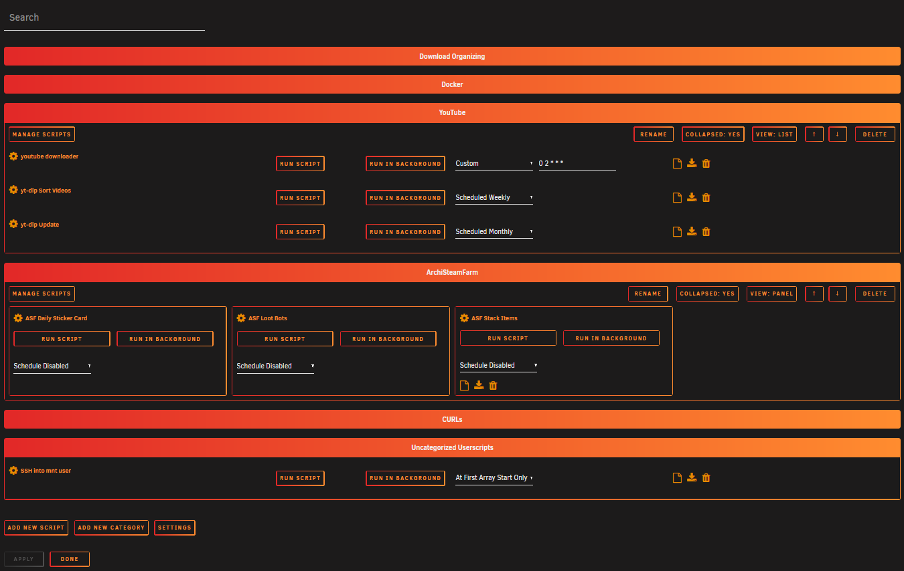
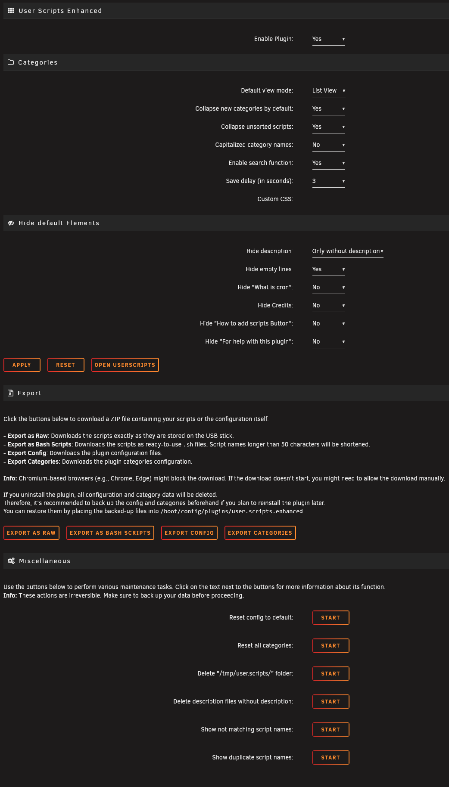

#  User Scripts Enhanced Plugin for Unraid

User Scripts Enhanced is a UI enhancement plugin for the original "User Scripts" plugin by Andrew Zawadzki (Squid).
It provides additional features and improved interface for managing user scripts on your Unraid server.

**Important**: The original [User Scripts plugin](https://forums.unraid.net/topic/48286-plugin-ca-user-scripts/) must be installed!

## Installation

This Plugin is not in the Community Applications (yet) so you need to manually install it.

1. Ensure you have the [User Scripts plugin](https://forums.unraid.net/topic/48286-plugin-ca-user-scripts/) installed
2. Connect to your Unraid server via SSH
3. Run:
   ```bash
   cd /boot/config/plugins
   wget https://github.com/Kurotaku-sama/user.scripts.enhanced/raw/main/user.scripts.enhanced.plg
   plugin install /boot/config/plugins/user.scripts.enhanced.plg
   ```

## Features

### UI Enhancements
- **Script Categories**: Organize scripts into collapsible categories
- **View Modes**: Two view modes can be used List & Panel
- **Clean Interface**: Hide unwanted elements to reduce page size
- **Custom CSS**: Adjust the appearance to match your theme
- **Export**: Export your scripts like they are stored on your drive or directly as usable .sh files


*Enhanced Userscripts interface*


*Settings interface*

## Disclaimer

This plugin is provided as-is without warranty. The developer cannot be held responsible for any data loss or system instability. Always maintain backups of important scripts and configurations.

---

**Note**: This plugin enhances but does not replace the original User Scripts functionality. All core scripting capabilities remain provided by the original plugin.
